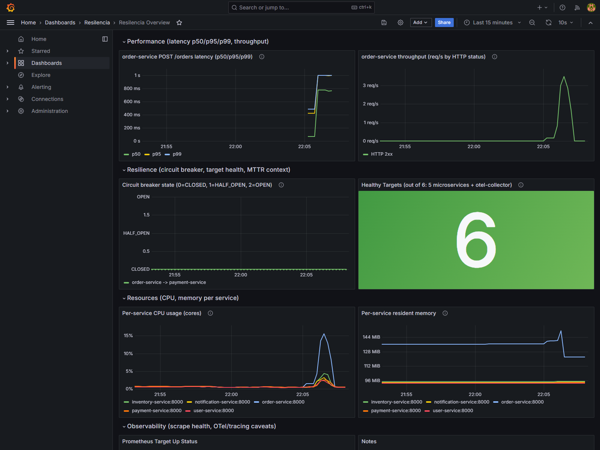
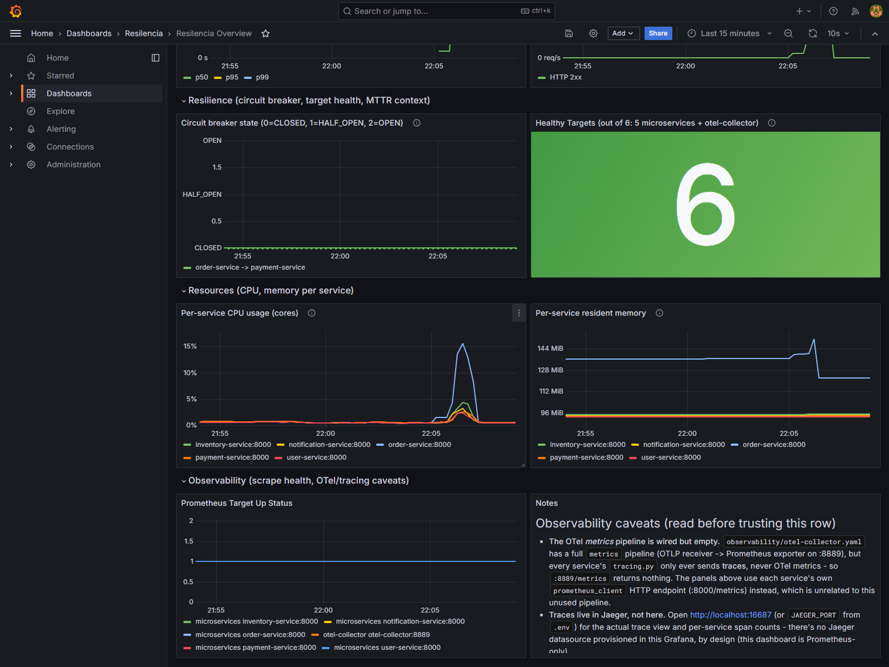

# Results — Evaluación Experimental de Estrategias de Resiliencia

Consolidated results for the proposal's four expected findings ("Resultados
Esperados": impact of retries on latency, circuit-breaker effectiveness,
autoscaling benefits under load, overhead of collecting metrics/traces),
drawing on every phase of `docs/ACTION-PLAN.md` (Phases 0-8). This is the
single top-level document Phase 8 asks for; every number here is sourced
from a per-phase results doc in `docs/tests/` - this file synthesizes, it
doesn't re-derive.

## Dashboard

`observability/grafana/dashboards/resilencia-overview.json`, extended in
Phase 8 with panels for all four metric sectors the proposal names
(Performance, Resilience, Resources, Observability) - previously it only
had two basic panels (healthy-target count, scrape status). Screenshots
below were captured live against the Compose stack during a real load test
(300ms latency injected on `inventory-service` + `scripts/k6/baseline.js`),
not staged.

**Bug fixed while building this dashboard:** every panel showed "No data"
at first, including the two pre-existing ones - `datasource.uid:
"prometheus"` was hardcoded in the dashboard JSON, but
`observability/grafana/provisioning/datasources/prometheus.yml` never
pinned an explicit `uid`, so Grafana auto-generated a random one
(`PBFA97CFB590B2093`) that didn't match. Fixed by pinning `uid: prometheus`
in the datasource provisioning file - a real, silent gap that existed since
Phase 0 and would have affected the original two panels as well, not just
the new ones.

**What the dashboard can't show, and where to find it instead:** business-
level success/failure (order-service returns HTTP 200 for both), CPU/RAM
at the container-cgroup level (`docker stats`, not process-level - Phase
5's numbers), Jaeger trace/span data, and OTel instrumentation overhead
are all measured directly against k6, `docker stats`, and the Jaeger API in
the per-phase docs cited throughout this file - not through Grafana. The
dashboard's own "Notes" panel documents this same list live.

## Finding 1: Impact of retries on latency

Source: `docs/tests/retries-results.md` (Phase 3).

Retries reduce error rate sharply under moderate dependency failure (30%
failure rate on `payment-service`): **3% → 99% order success** once a real
bug was found and fixed (`call_service()`'s retry loop only caught
transport exceptions, never a declined-payment response returned as a
normal HTTP 200 - so `RETRY_ENABLED` was a no-op against exactly the
failure mode this phase measures). The same root cause affected user
validation, inventory, and notification calls too; fixed generically.
Verified per service: `user-service` 73%→100%, `inventory-service`
47%→100%, `notification-service` 67%→97%.

**Latency did *not* clearly increase with retries in this codebase's
tests** - p95 was actually lower with retries than without in the Phase 3
run, because the dominant cost in this failure mode is the circuit breaker
opening and blocking traffic (see Finding 2), not the retry delay itself.
`docs/tests/retries-results.md`'s "Analysis" section proposes
latency-based chaos (rather than failure-rate-based) as a cleaner way to
isolate the "retries cost latency" trade-off if the report needs that
signal explicitly - not pursued further since the plan treats it as
optional follow-up work.

## Finding 2: Circuit-breaker effectiveness

Source: `docs/tests/circuit-breaker-results.md` (Phase 4).

With `payment-service` failing 80% of the time, the breaker rejected
**92-97% of failed orders fast** (without ever reaching `payment-service`)
across all runs - directly measuring the "reduced cascading failure"
result the proposal expects, in terms of load reaching the failing
service, not order success rate. At 80% failure, retries alone barely help
(0.4%→4.8% success, vs. 30% failure's 3%→99% - expected, since
`P(all 4 attempts fail)` is ~41% at 80% vs. ~0.8% at 30%): **the breaker's
benefit matters most precisely when retries can no longer rescue the
result.**

A real concurrency bug was found and fixed along the way: the
`OPEN -> HALF_OPEN` transition had no lock, so under concurrent load every
in-flight request could see the flipped state and slip through together (a
thundering herd) instead of a single probe - confirmed by `failures`
overshooting the threshold (8-9 instead of 3). Fixed with an `asyncio.Lock`
guarding only the state check/transition (not the downstream call, so no
throughput cost in the normal `CLOSED` path). Latency improved after the
fix: p99 835ms (with the bug) → 496ms (fixed, no retries).

Recovery works end to end: clearing chaos and a single successful probe
closes the circuit. Phase 7's dependency-failure fault
(`docs/tests/fault-dependency-failure-results.md`) adds a useful contrast:
a **stateless** chaos toggle (plain `FAILURE_RATE`) recovers *instantly*
on reset, while the **stateful** circuit breaker needs at least one full
`recovery_timeout` (15s) window - a mechanism with memory has its own
recovery latency by design, one without memory doesn't.

## Finding 3: Autoscaling benefits under load

Sources: `docs/tests/resources-observability-results.md` (Phase 5),
`docs/tests/kubernetes-results.md` (Phase 6),
`docs/tests/fault-cpu-saturation-results.md` and
`docs/tests/fault-pod-container-kill-results.md` (Phase 7).

**Without autoscaling (Compose, Phase 5):** `order-service` is the clear
CPU bottleneck under `stress-test.js` (200 VUs) - 83% avg / 110% max CPU
(one full uncapped host core), ~40ms CPU cost per order (as much as the
other four services combined). Latency degrades hard under load (p95 up
to 13.98s at 200 VUs vs. <300ms at 10 VUs) but **99.9% of orders still
complete** - the system slows down, it doesn't fall over.

**With autoscaling (Kubernetes, Phase 6):** `order-service-hpa` genuinely
scales - **1 → 3 replicas** under the identical `stress-test.js` load,
confirmed via the `SuccessfulRescale` Kubernetes event (CPU utilization
peaked at 201% of the 70% target). `payment-service-hpa` correctly stayed
at 1 replica (only reaches 30% CPU - it's loaded indirectly through
`order-service`, consistent with the Phase 5 bottleneck finding).

**The direct comparison needs two caveats, both documented rather than
smoothed over:** (1) each Kubernetes pod is CPU-capped at 200m - five
times tighter than Compose's uncapped container - so a single pod degrades
faster by design, which is exactly what the HPA exists to compensate for,
given time to schedule new replicas (matching the ~11-27s pod-startup MTTR
measured across independent runs in Phase 6/7); (2) the load reached the cluster through `kubectl
port-forward` (this Windows/Docker-driver minikube setup has no direct
NodePort path from the host - see `docs/TOOLING.md`), which adds its own
latency and jitter on top of the cluster's real behavior. **The
trustworthy signal is the HPA event itself, not the absolute latency
numbers on the Kubernetes side.**

**The clearest, most direct autoscaling-adjacent resilience benefit
measured is actually self-healing, not scaling:** Phase 7's pod-kill fault
found Compose has **no automatic recovery at all** (no service sets a
`restart:` policy - a killed container stays dead until a human
intervenes) versus Kubernetes' **automatic MTTR of tens of seconds**
(11.55s and 26.50s across two independent runs - see
`docs/tests/kubernetes-results.md`) for the same
fault. This is the sharpest, most unambiguous "Kubernetes resilience
mechanism" result in the whole project - no confounding factors, same
fault, binary difference in outcome.

## Finding 4: Overhead of collecting metrics and traces

Source: `docs/tests/resources-observability-results.md` (Phase 5).

OpenTelemetry adds **+35-42% to median/p95 latency** (p50: 239.64ms →
139.80ms without OTel; p95: 506ms → 295.5ms) - a real, considerable cost,
not a rounding error. This was discovered to be trivially toggleable:
`OTEL_SDK_DISABLED` is a standard OTel env var the Python SDK already
respects with zero code changes to `tracing.py`; the only fix needed was
forwarding it through `compose.yml` (Compose doesn't pass arbitrary host
env vars into containers automatically).

**Span loss:** none detected at the load level reached (~21-43 req/s peak
- Jaeger registered 5218 traces for 5159 real requests). This is not a
strong proof the pipeline is lossless at higher throughput -
`order-service`'s own CPU ceiling was hit before the tracing pipeline
showed any strain, so the export pipeline was never actually stressed.

**Sampling impact was deliberately not measured** - it would require
adding `OTEL_TRACES_SAMPLER`/`OTEL_TRACES_SAMPLER_ARG` support to
`services/*/tracing.py`, which doesn't exist today and which the plan
treats as new optional work, not a bug fix. Confirmed still true as of
Phase 8 (`docs/tests/fault-cpu-saturation-results.md` cross-checked this
during a different fault and found no sampler code either) - left as a
concrete implementation note for whoever picks up sampling-impact
measurement next.

## Summary table (all four sectors, all mechanisms tested)

| Sector | Baseline (Phase 1) | Retries (Phase 3) | Circuit breaker (Phase 4) | Kubernetes (Phase 6-7) |
| --- | --- | --- | --- | --- |
| **Performance** | p50 133-167ms, p95 276-403ms, 0% errors | p95 lower than no-retries in this codebase's failure mode (breaker dominates cost, not retry delay) | p99 835ms (bug) -> 496ms (fixed) | HPA scale-out reduces sustained overload, but absolute Kubernetes numbers here are inflated by the 200m CPU cap + port-forward tunnel |
| **Resilience (MTTR/availability)** | n/a (no faults injected) | 3%->99% success at 30% payment failure (after fix) | 92-97% of failed orders rejected fast at 80% failure | **Pod-kill MTTR: unbounded in Compose vs. ~11-27s in Kubernetes** (2 samples) - the headline result |
| **Resources** | order-service ~40ms CPU/order, the clear bottleneck | no change measured | reduced contention after the concurrency fix | HPA scales the bottleneck service (1->3 replicas) under real CPU saturation |
| **Observability** | OTel adds +35-42% latency; no span loss at ~21-43 req/s | n/a | n/a | Grafana dashboard (Phase 8) now surfaces Performance/Resilience/Resources/Observability live; sampling impact still unmeasured |

## Proposal-fidelity check (2026-09-07)

Read the source proposal PDF directly (not just this repo's own
`ACTION-PLAN.md` interpretation of it) and cross-checked every literal
requirement against the live, running system. Everything else matched;
one real gap found and fixed: the proposal specifies `user-service` owns
"los datos del usuario, validación **y el historial de pedidos**" - no
per-user order history endpoint existed anywhere (`user-service` only had
CRUD + validation; `order-service` had no per-user filter either). Added
`GET /users/{user_id}/orders` to `user-service`, reading the shared
`orders` table directly (no network hop) - 404 for a nonexistent
customer, `[]` for one with no orders, real history otherwise. Verified
live in both Compose and Kubernetes; exposed via `cli.py users orders
--user-id N`. See `docs/services/user-service.md`.

One remaining literal deviation, not fixed (bigger change, functionally
inconsequential): the proposal says "OpenTelemetry para las trazas y las
métricas" - in this system OTel only carries traces; metrics come from a
separate `prometheus_client` integration per service, scraped directly by
Prometheus. The four metric sectors the proposal asks for are still fully
measured (see the dashboard and every `docs/tests/*.md`), just not
through OTel's own metrics pipeline specifically.

## What's still open

Closed by Phases 10-11 (kept here as a record, not because they're still
open): Helm packaging (`charts/resilencia/`, real `helm install` verified),
Prometheus alerting (`observability/alerts.yml`, `CircuitBreakerOpen`
driven to a real `firing` state), OTel sampling
(`OTEL_TRACES_SAMPLER`/`_ARG` in all 5 `tracing.py`, impact measured in
`docs/tests/sampling-results.md`), the JMeter smoke test
(`docs/tests/jmeter-results.md`, 215 requests run for real), and
Kubernetes' Grafana provisioning (now mounted, plus two real bugs found
while wiring it up - K8s Prometheus was never scraping the microservices,
and Jaeger's K8s Service never exposed its OTLP port - both fixed, see
`docs/tests/kubernetes-hardening-results.md`).

Genuinely still open:

- **HPA-at-`maxReplicas` alerting** was scoped out of Phase 11's alert
  rules - it needs `kube-state-metrics` scraped into Prometheus (for
  replica-count metrics), which isn't deployed. The other three alert
  types (service down, circuit breaker open, high latency) don't need it.
- **Phase 9's "skip" decision was reversed by Phase 12** (planned, not
  started): a later audit found a real gap the skip decision missed - no
  existing surface (`cli.py` or Grafana) can edit/delete records or show
  per-service resource usage in one place, which a "team control
  interface" needs for day-to-day administration, not just monitoring.
  See `docs/ACTION-PLAN.md` Phase 12 for the full scope and design
  instructions.
